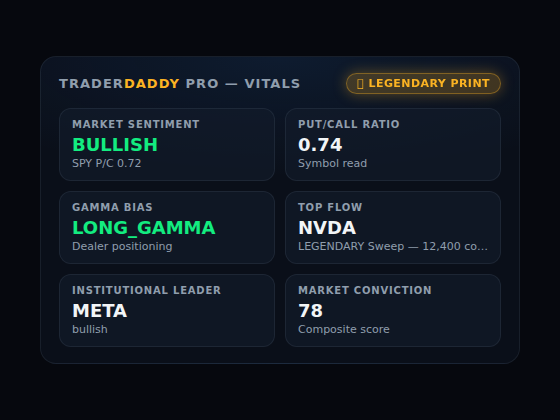

# DaddyHome

> TraderDaddy Pro **on your wall and in your smart home** — a TRMNL e-ink plugin
> and a Home Assistant integration.

**Status:** ✅ Home Assistant integration built (HACS-installable, keyless demo
mode; add your `td_live_` key to go live) — now covering the **full 24-tool SDK
surface** across sensors, binary sensors, events, and calendars, plus a custom
Lovelace card. 🚧 TRMNL e-ink plugin still to come.

Part of the [TraderDaddy Pro](https://traderdaddy.pro) open-source family, alongside
[DaddyBoard](https://github.com/mphinance/daddyboard). Depends on
[traderdaddy-sdk](https://github.com/mphinance/traderdaddy-sdk) (TS) and the
Python mirror [`traderdaddy`](https://pypi.org/project/traderdaddy/).

**Customizing it?** Grab a prompt from [`PROMPTS.md`](PROMPTS.md) and paste it into
Claude Code / Cursor. Agents working in this repo should read [`CLAUDE.md`](CLAUDE.md).

---

## Why this exists

DaddyBoard already proved the hardware-hacker overlap. DaddyHome rides two
existing open-source communities with their own distribution:

- **TRMNL** — the open-source e-ink dashboard device with a plugin marketplace.
- **Home Assistant** — huge open-source smart-home community; integrations are
  discoverable via HACS.

Both put TraderDaddy Pro in front of tinkerers who love self-hosting appliances.

## The custom card

A vanilla-JS, no-build Lovelace card (`www/traderdaddy-vitals-card.js`) — same
no-build trick DaddyBoard uses — showing sentiment, put/call, gamma bias, top
flow, institutional leader, and market conviction in a dark glassmorphism tile
grid, with a glowing badge when a LEGENDARY print is on the tape:

Install it: `Settings -> Dashboards -> ⋮ -> Resources -> Add Resource`, URL
`/local/traderdaddy-vitals-card.js`, type **JavaScript Module**. Then add a
card with `type: custom:traderdaddy-vitals-card`. Entity ids are
auto-detected from HA's default naming (`sensor.traderdaddy_pro_*`); override
any of them via an `entities:` map in the card config if yours differ.

Want to preview it without a running HA instance? Open `www/preview.html`
directly in a browser — it stubs `hass` with mock data matching the real
sensor attribute shapes.

## What it does

**TRMNL plugin** — a private plugin that renders a glanceable e-ink screen:
market vitals, put/call, gamma bias, top flow print. E-ink is low-refresh, so
poll on a slow market-hours cadence.

**Home Assistant integration** — exposes the entire TraderDaddy Pro tool set
as HA entities across four platforms (sensor, binary_sensor, event, calendar),
plus one service. Users build their own automations/dashboards on top — flash
a light on a LEGENDARY print, fire a script when gamma flips short, drop the
earnings/dividend/economic calendars straight into HA's calendar dashboard.

## Architecture

Two `DataUpdateCoordinator`s share **one** `TraderDaddy` client instance
(created once in `__init__.py`), so there's still exactly one SDK
instantiation, just two poll cadences:

- **`coordinator.py`** (fast tier) — market-wide vitals + the tracked
  symbol's core reads. 2 min while the market's open, 15 min closed. Polls
  `market_stats`, `unusual_activity`, `gex_overview`, `iv_rank`, `sector_flow`,
  `put_call_ratios`, `market_health`, `institutional_activity`, `conviction`
  (market-wide), `bounce_signals` — 10 tools.
- **`coordinator_slow.py`** (slow tier) — everything scoped to the tracked
  symbol plus the heavier/rotating tools. 10 min open / 30 min closed. Polls
  `run_screener` (rotates through 10 screeners, one per cycle — mirrors
  DaddyBoard's rotation trick), `strategy_ideas`, `edge_xray`, `gex_ticker`,
  `apex_levels`, `bounce_score`, `conviction` (symbol), `long_term_quality`,
  `politician_trades`, `politician_trades_by_ticker`, `dividend_calendar`,
  `economic_calendar`, `earnings_flow`, `ipo_scanner` (rotates 4 views) — 14
  tools.

That's all 24 SDK tools polled. `hedge_analysis` needs call-time args
(`shares`, `basis?`) so it isn't polled — it's registered as an HA **service
with response data**: `traderdaddy.hedge_analysis`.

- **TRMNL:** either their hosted "private plugin" (a polling URL that returns
  markup/JSON) or a small self-hosted push service. Use the **TS SDK** if it's a
  Node service.
- **Home Assistant:** a custom component (Python) — this is what needs the
  **Python `traderdaddy` SDK**.

## Entities

### Sensors — fast tier (`coordinator.py`, market-hours cadence)

| Entity | Source tool | State |
|---|---|---|
| `sensor.td_market_sentiment` | `market_stats` | SPY sentiment (bullish/bearish/neutral) |
| `sensor.td_put_call_ratio` | `put_call_ratios` | Tracked symbol's put/call ratio |
| `sensor.td_gamma_bias` | `gex_overview` | Market-wide gamma bias |
| `sensor.td_iv_rank` | `iv_rank` | Tracked symbol's IV rank (%) |
| `sensor.td_sector_leader` | `sector_flow` | Dominant sector by flow |
| `sensor.td_top_flow` | `unusual_activity` | Top ticker on the unusual-activity tape |
| `sensor.td_total_flow_premium` | `unusual_activity` | Aggregate premium across the tape (USD) |
| `sensor.td_market_health` | `market_health` | Composite health label + alert/watch counts |
| `sensor.td_institutional_leader` | `institutional_activity` | Top ticker by institutional flow |
| `sensor.td_conviction_market` | `conviction` | Market-wide conviction score |
| `sensor.td_bounce_signal_top` | `bounce_signals` | Top current bounce-signal ticker |

### Sensors — slow tier (`coordinator_slow.py`, tracked-symbol + rotating)

| Entity | Source tool | State |
|---|---|---|
| `sensor.td_featured_screener` | `run_screener` (rotates) | Name of the currently-rotated screener |
| `sensor.td_strategy_idea_top` | `strategy_ideas` | Top strategy archetype for the tracked symbol |
| `sensor.td_edge_xray_bias` | `edge_xray` | Overall IV-edge bias |
| `sensor.td_gex_ticker_bias` | `gex_ticker` | Tracked symbol's gamma bias |
| `sensor.td_apex_level_top` | `apex_levels` | Top magnet strike (USD) |
| `sensor.td_bounce_score_symbol` | `bounce_score` | Tracked symbol's composite bounce score |
| `sensor.td_conviction_symbol` | `conviction` | Tracked symbol's conviction score |
| `sensor.td_long_term_quality` | `long_term_quality` | Tracked symbol's quality score |
| `sensor.td_politician_top_portfolio` | `politician_trades` | Top politician by estimated position |
| `sensor.td_politician_latest_trade` | `politician_trades_by_ticker` | Latest politician trade on the tracked symbol |
| `sensor.td_next_dividend` | `dividend_calendar` | Next upcoming ex-dividend symbol |
| `sensor.td_ipo_highlight` | `ipo_scanner` (rotates) | Top company in the currently-rotated IPO view |

### Binary sensors (fast tier)

| Entity | On when |
|---|---|
| `binary_sensor.td_legendary_print` | A LEGENDARY-tier print is currently on the tape |
| `binary_sensor.td_gamma_flip` | Market-wide gamma bias is `SHORT_GAMMA` |
| `binary_sensor.td_elevated_risk` | `market_health` alert count ≥ 3 |
| `binary_sensor.td_bounce_signal` | At least one active bounce signal |
| `binary_sensor.td_high_conviction` | Market conviction score ≥ 70 |

### Events

Each fires a `new_item` event exactly once per genuinely new id — the ideal
automation trigger for "notify me the moment this happens" (as opposed to the
binary sensors above, which reflect current on/off state).

| Entity | Fires on |
|---|---|
| `event.td_new_print` | Any new row on the unusual-activity tape (any tier) |
| `event.td_new_politician_trade` | A new politician trade on the tracked symbol |
| `event.td_new_ipo_listing` | A new company in the current IPO scanner view |
| `event.td_earnings_approaching` | A new upcoming-earnings entry appears |

### Calendars

Native HA `calendar` entities — usable in the built-in calendar dashboard and
in automations/templates without a helper sensor.

| Entity | Source |
|---|---|
| `calendar.td_economic_calendar` | `economic_calendar` |
| `calendar.td_earnings_calendar` | `earnings_flow` |
| `calendar.td_dividend_calendar` | `dividend_calendar` |

### Service

`traderdaddy.hedge_analysis` — call with `symbol`, `shares`, optional `basis`/
`atr`/`limit`; returns the hedge-analysis response as response data (needs
call-time args, so it's a service rather than a polled sensor).

## Automation blueprint

[`blueprints/automation/traderdaddy/notify_on_legendary_print.yaml`](blueprints/automation/traderdaddy/notify_on_legendary_print.yaml)
— import it via **Settings -> Automations -> Blueprints -> Import Blueprint**
(paste the raw GitHub URL) for a ready-made "notify me on a LEGENDARY print"
automation: pick your legendary-print binary sensor, pick a notify action,
optionally wire in the top-flow sensor for a `{{ top_flow }}` template
variable in your message. No YAML/Python required.

## Diagnostics

Every config entry supports HA's standard **Download diagnostics** (Settings
-> Devices & Services -> TraderDaddy Pro -> ⋮) — a redacted JSON dump (API
key stripped) of the entry plus both coordinators' current cached data.
Handy for bug reports.

## Long-term trend: Grafana

HA's recorder only keeps ~10 days. See [`docs/GRAFANA.md`](docs/GRAFANA.md)
for an InfluxDB + Grafana recipe (with an importable
[`docs/grafana-dashboard.json`](docs/grafana-dashboard.json)) if you want
conviction/quality/sentiment trend charts that go back further.

## Key-safety model

Self-host/personal: the user supplies their own `td_live_` key — in TRMNL's
plugin settings or HA's config flow. Two coordinator tiers, one shared client,
naturally rate-limit-friendly. Need to rotate a key or go from demo to live?
**Settings -> Devices & Services -> TraderDaddy Pro -> Configure** — the
options flow validates a new key live before applying it, no need to delete
and re-add the integration.

## Status & what's next

**Done:**

1. ✅ Python `traderdaddy` SDK (the prereq) — shipped on PyPI.
2. ✅ HA custom component: config flow + fast/slow coordinators covering the
   full 24-tool SDK surface — sensors, binary sensors, events, calendars, and
   a service, all demo-first (`mock=True` with no key).
3. ✅ HACS metadata (`hacs.json`) for custom-repo install.
4. ✅ Custom Lovelace card (`www/`) + Grafana/InfluxDB long-term-trend recipe
   (`docs/`).
5. ✅ Predictable `sensor.td_*` entity ids (`_attr_suggested_object_id`),
   diagnostics download support, an importable notify-on-legendary
   automation blueprint, and in-place API key rotation via the options flow.

**Still to come:**

6. 🚧 TRMNL plugin — pick hosted-private vs self-host push; render the e-ink
   layout on the **TS** SDK (reuse DaddyBoard's panel data shapes).
7. 🚧 Multi-ticker support (watching more than one symbol) — a real
   architecture project (HA config subentries, per-symbol devices); deferred,
   see `FINDINGS.md`.
8. 🚧 Photos/screenshots on real hardware for the listings.

Adding a sensor, tuning the cadence, or starting the TRMNL plugin? Grab a prompt
from [`PROMPTS.md`](PROMPTS.md); [`CLAUDE.md`](CLAUDE.md) has the conventions.
